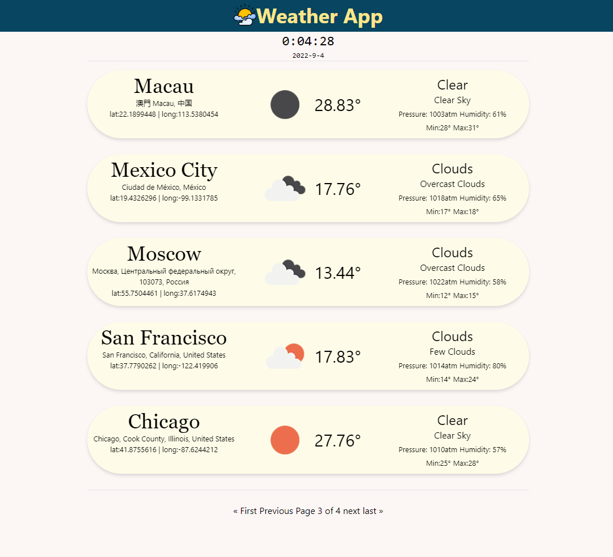

# Weather App Django

## Features

- display current weather status for a specific location in a paginated view
- Integrated openweathermap API for weather data

## Tech Stack

- Backend: Django
- Frontend: Tailwind
- Database: sqlite3
- APIs & Modules:
  - openweathermap
  - geopy

## Screenshots

